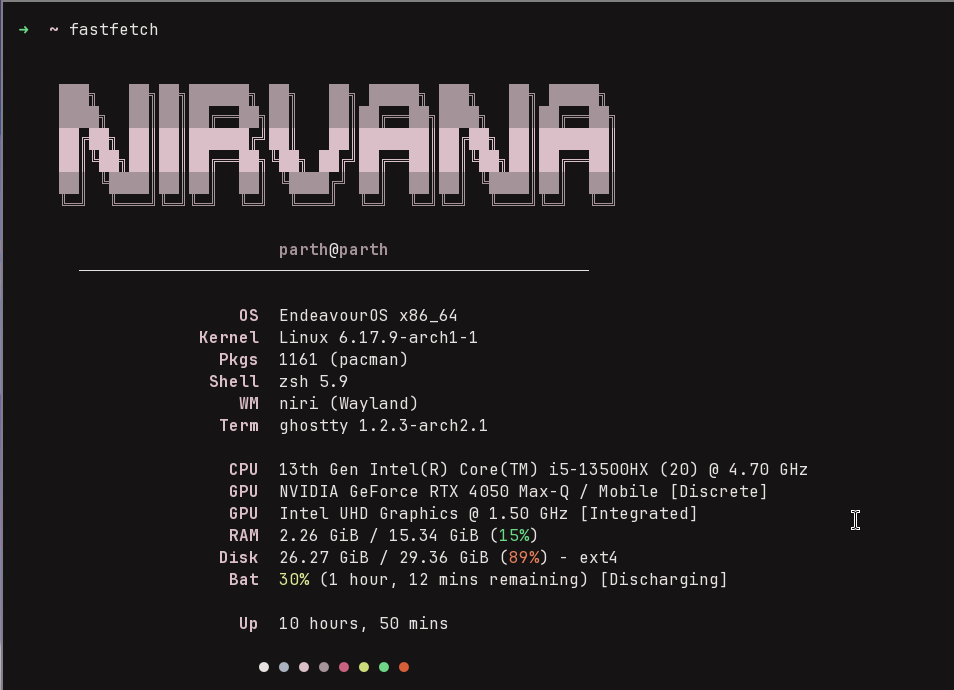

# Nirvana

> A blissful, minimal shell for Niri — peace in your workflow.

A lightweight top panel and control center for [Niri](https://github.com/YaLTeR/niri) Wayland compositor, built with [Quickshell](https://quickshell.outfoxxed.me/).


## 📸 Screenshots

| Fastfetch | Control Panel |
|:---------:|:-------------:|
|  |  |

<p align="center">
  <em>Minimal Bar</em><br/>
  <br/><br/>
  <em>Expanded Bar (Network Speed + System Stats)</em><br/>
  
</p>

## ✨ Features

### Top Panel
- **Workspace Indicator** — Visual pills showing active/inactive workspaces
- **Focused App** — Currently focused window title
- **Network Speed** — Toggle-able upload/download monitor
- **Status Icons** — WiFi, Bluetooth, Battery, Airplane mode, Night light
- **Clock** — Clean time display

### Control Center
- **Quick Toggles** — WiFi, Bluetooth, Airplane Mode, Night Light
- **Sliders** — Volume (PipeWire), Brightness
- **Power Profiles** — Power Saver / Balanced / Performance
- **System Stats** — CPU usage, temperature, RAM
- **Media Controls** — Now playing with artist/title
- **Quick Actions** — Lock screen

## 📋 TODO

- [ ] Notifications
- [ ] Power menu
- [ ] Calendar widget
- [ ] System tray

## 🚀 Installation

### Quick Install (Arch-based)

```bash
git clone https://github.com/parth-sarthi-code/quickshell-niri-panel.git ~/.config/quickshell
python3 ~/.config/quickshell/scripts/install.py
```

The installer will:
- Install dependencies (pacman/AUR)
- Set up Nirvana config + fastfetch theme
- Install optimized Niri config (for Niri 25.11)
- Show run instructions

### Manual Install

```bash
git clone https://github.com/parth-sarthi-code/quickshell-niri-panel.git ~/.config/quickshell
LD_LIBRARY_PATH=/usr/lib/qt6/qml/Niri:$LD_LIBRARY_PATH quickshell
```

### Auto-start with Niri

Add to `~/.config/niri/config.kdl`:

```kdl
spawn-at-startup "sh" "-c" "LD_LIBRARY_PATH=/usr/lib/qt6/qml/Niri:$LD_LIBRARY_PATH quickshell"
```

## 🛠️ Dependencies

**Required:**
- [Quickshell](https://quickshell.outfoxxed.me/) >= 0.2.1 (`quickshell-git` on AUR)
- [Niri](https://github.com/YaLTeR/niri) >= 25.11
- Qt 6.10+

**Optional (tested on Arch Linux):**

| Category | Package | Description |
|----------|---------|-------------|
| Audio | `wireplumber` | PipeWire session manager |
| Audio | `playerctl` | Media controls |
| Hardware | `brightnessctl` | Brightness control |
| Hardware | `bluez` | Bluetooth support |
| Network | `networkmanager` | Network management |
| Power | `tuned` | Power profiles daemon |
| Display | `gammastep` | Night light / blue light filter |
| Display | `swaybg` | Wallpaper manager |
| Utilities | `fuzzel` | App launcher (Mod+Space) |
| Utilities | `swaylock` | Screen locker |
| Utilities | `mate-polkit` | Polkit authentication agent |
| Utilities | `fastfetch` | System info fetch tool |

**Recommended Apps (used in keybindings):**
- `ghostty` — Terminal (Mod+T)
- `google-chrome` — Browser (Mod+B)
- `nautilus` — File manager (Mod+E)

**Fonts:**
- `ttf-sf-pro` — SF Pro Display
- `otf-font-awesome` — Font Awesome icons
- `ttf-nerd-fonts-symbols` — Nerd Font icons

## 📁 Structure

```
~/.config/quickshell/
├── shell.qml           # Entry point
├── Config.qml          # Theme configuration
├── components/         # UI components
│   ├── TopPanel.qml
│   └── controlcenter/
├── services/           # System services
├── scripts/            # Install & utility scripts
│   ├── install.py
│   └── set-wallpaper.sh
└── niri/               # Niri config (installed to ~/.config/niri/)
    ├── config.kdl      # Optimized for Niri 25.11
    └── animations.kdl  # Custom animations (optional)
```

## ⌨️ Key Bindings (Niri 25.11)

| Binding | Action |
|---------|--------|
| `Alt+Tab` | Recent windows switcher (native) |
| `Mod+A` | Overview |
| `Mod+Space` | App launcher (fuzzel) |
| `Mod+T` | Terminal (ghostty) |
| `Mod+B` | Browser (google-chrome) |
| `Mod+E` | File manager (nautilus) |
| `Mod+M` | Maximize window to edges |
| `Mod+Q` | Close window |

## ⚙️ Configuration

Edit `Config.qml`:

```qml
readonly property int panelHeight: 32
readonly property real panelOpacity: 0.45
readonly property color accentColor: "#007AFF"
readonly property string fontFamily: "SF Pro Display, Inter, sans-serif"
```

## 📝 License

MIT
